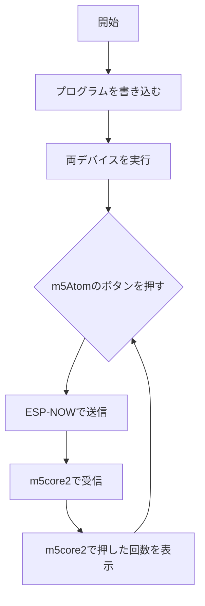

# ESP-NOW 簡単な例 / ESP-NOW Simple Example

## 日本語

### 概要
ESP-NOWを使う初心者向けの簡単な例です。複雑な機能は省いて、まずは基本的な通信を動かすことに焦点を当てています。

### 特徴
#### デバイスの役割
- 送信側: m5AtomS3Lite
- 受信側: m5core2

#### ESP-NOWの主要設定
ESP-NOWを使用するには、以下の設定が必要です：
1. 使用するWiFiチャンネルの設定
2. 送信側で、送信先（受信側）のMACアドレスを追加

このサンプルでは、上記の基本的な設定方法と、ESP-NOWを使用したシンプルな通信の実装方法を示しています。

### 使用手順
1. それぞれのプログラムをm5AtomS3Lite（送信側）とm5core2（受信側）に書き込みます。
2. 両方のデバイスを実行します。
3. m5Atomのボタンを押します。
4. m5Atomのボタンを押すたびに、ボタンを押した回数がESP-NOWによって通信され、m5core2に表示されます。

この簡単なデモンストレーションは、2つのデバイス間のESP-NOW通信の基本的な機能を示しています。

## English

### Overview
A beginner-friendly example of using ESP-NOW. This project focuses on getting basic communication working without complex features.

### Features
#### Device Roles
- Transmitter: m5AtomS3Lite
- Receiver: m5core2

#### Key ESP-NOW Settings
To use ESP-NOW, the following settings are necessary:
1. Configure the WiFi channel to be used
2. Add the MAC address of the intended receiver on the transmitter side

This sample demonstrates how to implement these basic settings and achieve simple communication using ESP-NOW.

### Usage Instructions
1. Flash the respective programs to the m5AtomS3Lite (transmitter) and m5core2 (receiver).
2. Run both devices.
3. Press the button on the m5Atom.
4. Each time you press the button on the m5Atom, the number of button presses will be communicated via ESP-NOW and displayed on the m5core2.

This simple demonstration showcases the basic functionality of ESP-NOW communication between two devices.
